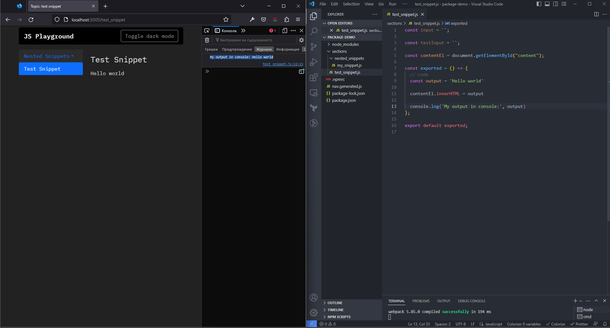

# Description



This is a simple JS/TS code playground framework that I created in order to test code snippets, play Advent of Code, etc a while ago. As my original project got larger, I decided to encapsulate the code-running logic in a package.

All the playground files are listed in a clickable sidebar explorer. Nesting is possible too. To test the output you can use both the DOM and Devtools console.

You can see the updated output after each save as well.

<br/>
<br/>

# Usage

<br/>

1. Install the package

```
npm install @mariamaneva/js-playground
```

2. In your root package.json file, add the following script commands:

```
"scripts": {
  // add these lines
  "start": "npm run start --prefix node_modules/@mariamaneva/js-playground",
  "new-page": "npm run new-page --prefix node_modules/@mariamaneva/js-playground",
  "update-nav": "npm run update-nav --prefix node_modules/@mariamaneva/js-playground",
  "help": "npm run help --prefix node_modules/@mariamaneva/js-playground"
}
```

3. Create a new playground page:

```
npm run new-page --path <your_page_name>.js
```

OR

```
npm run new-page --path <your_page_name>.ts
```

4. Start the project

```
npm start
```

5.  Open **`<your_page_name>.js`** file from the **`sections`** folder and add your code where the `// code` comment is. As you keep updating and saving you can monitor your output in the respective page within the browser.

<br/>
<br/>


### Adding a new page
<br/>

Repeat **step 3** and re-run the project every time you need a new playground file.

<br/>


### Updating the sidebar explorer
<br/>

If you deleted any files from the sections folder, run **`npm run update-nav`** and re-start the project to update the sidebar explorer
